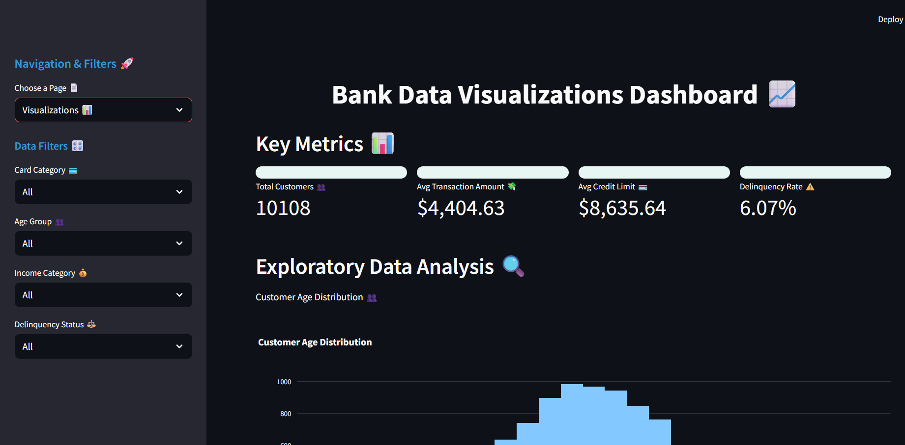
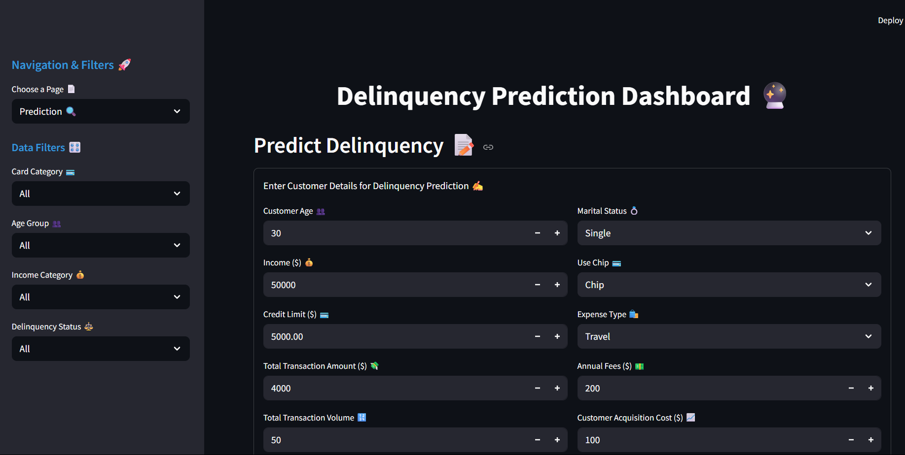

# 💳 Bank Data Analysis & Delinquency/Churn Prediction Platform 🌟

 <!-- Replace with your banner image -->

Unlock powerful customer behavior analytics, risk prediction, and churn insights with this all-in-one Python-based data science platform! 🚀 Built with Streamlit, this interactive dashboard empowers financial institutions to analyze credit card portfolios, predict delinquency and churn, and derive actionable insights for customer retention strategies, personalized marketing, risk-based credit decisions, and financial planning & forecasting. Dive into stunning visualizations and make data-driven decisions with ease! 💸

[](https://www.python.org/) [](https://streamlit.io/) [](LICENSE) [](https://github.com/yourusername/bank-data-analysis/stargazers)

---

## 📌 Project Overview

This project performs a comprehensive analysis of anonymized credit card customer data, combining data analysis, machine learning, and web development to create a user-friendly dashboard for banking professionals. Built with Python and Streamlit, it leverages credit card and customer demographic data to visualize key metrics, predict customer delinquency and churn using an XGBoost model, and explore data relationships through a clear correlation heatmap. Ideal for data analysts, bank managers, financial advisors, or recruiters looking to see skills in **Python**, **Streamlit**, **pandas**, **scikit-learn**, **XGBoost**, and **data visualization** (Plotly, Seaborn, Matplotlib).

The dataset contains anonymized credit card customer profiles with key features:
- **Demographic Info**: Age, Gender, Education Level, Marital Status
- **Credit Behavior**: Credit Limit, Average Transaction Value, Total Transaction Count
- **Engagement Metrics**: Tenure, Card Category, Contacts, Dependent Count
- **Risk/Churn Labels**: Delinquency Status (Delinquent_Acc) and potential churn indicators

---

## 🎯 Objectives

- Analyze customer profiles and behaviors to identify trends and KPIs.
- Visualize insights with interactive plots for business users.
- Segment customers by usage, loyalty, and risk using filters.
- Predict customer delinquency and churn using machine learning models.
- Recommend actionable business insights for retention, marketing, and risk management.

---

## ✨ Features

- **Two Interactive Pages** 📄:
  - **Visualizations Page** 📈: Showcases 5 dynamic plots, including a neat correlation heatmap and an Income vs. Transaction Amount scatter plot.
  - **Prediction Page** 🔮: Allows input of customer details to predict delinquency/churn with probability scores.
- **Engaging Visuals** 🎨:
  - 📊 Histograms, box plots, line charts, scatter plots, and a readable correlation heatmap.
  - 🏆 Model performance metrics (Accuracy: 0.9042, ROC AUC: 0.5429).
- **User-Friendly Filters** 🎛️:
  - Dropdown menus for Card Category, Age Group, Income Category, and Delinquency Status.
- **Custom Styling** 💅:
  - Emojis, modern CSS, and green-themed buttons for a vibrant interface.
- **Data Download** 📥:
  - Export filtered datasets as CSV for further analysis.

---

## 📈 Key Insights

- **Customer Segmentation** 🔹:
  - High-income customers (> $75,000) tend to have higher transaction volumes and lower churn/delinquency rates.
  - Customers with more contacts (>5) and longer tenure (>2 years) exhibit greater loyalty.
- **Risk Indicators** 🔹:
  - Low average transaction value (<$500) with <20 transactions signals a high risk of churn or delinquency.
  - Inactive users with credit limits > $10,000 pose a significant financial risk.
- **Delinquency/Churn Prediction** 🔹:
  - The XGBoost model (ROC AUC: 0.5429) identifies the 36-45 age group and incomes < $50,000 as high-risk.
  - Approximately 6% of customers are delinquent, with higher rates among mid-career or lower-income segments.
  - Customers with `Avg_Transaction_Value` above $1000 and `Total_Trans_Vol` exceeding 50 transactions monthly are more likely to be delinquent, indicating overspending risk.
  - `Net_Revenue_per_Customer` shows a positive correlation with `Interest_Earned`, but high acquisition costs reduce profitability for delinquent accounts.

---

## 💡 Actions to Take

This platform benefits **bank managers**, **data analysts**, and **financial advisors** in the **banking and finance field**:
- **Bank Managers**: Offer financial literacy to the 36-45 age group, adjust credit limits for inactive high-limit users, incentivize loyal customers (>5 contacts, >2 years tenure) with personalized offers, and target high-transaction customers with payment plans.
- **Data Analysts**: Enhance the model with behavioral features (e.g., payment history) and re-evaluate with a larger dataset to improve ROC AUC; investigate overspending patterns for feature engineering.
- **Financial Advisors**: Advise clients with low transaction values (<$500) and incomes < $50,000 to diversify income or reduce credit reliance, monitoring engagement metrics and recommending budgeting strategies.

---

## 🛠️ Tech Stack

- **Programming**: Python 🐍
- **Web App**: Streamlit 🌐
- **Data Processing**: pandas, NumPy 📊
- **Machine Learning**: scikit-learn, XGBoost, imbalanced-learn 🤖
- **Visualization**: Plotly, Seaborn, Matplotlib 📈
- **Environment**: Conda 🧪

---

## 📸 Screenshots

### Visualizations Page 📊
 <!-- Replace with actual screenshot of the heatmap -->

### Prediction Page 🔍
 <!-- Replace with actual screenshot -->

---

## 🚀 Getting Started

Follow these steps to run the app locally and explore its features! 🖥️

### Prerequisites
- Python 3.8+ 🐍
- Conda environment (recommended) 🧪
- Git installed 📂

### Installation
1. **Clone the Repository**:
   ```bash
   git clone https://github.com/yourusername/bank-data-analysis.git
   cd bank-data-analysis
