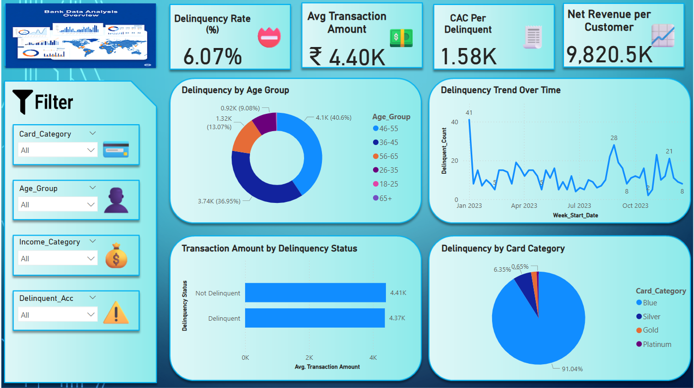
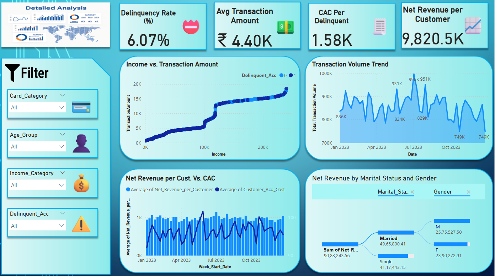

# 💳 Bank Customer Data Analysis Dashboard

An interactive and visually engaging Power BI dashboard that analyzes bank customer behavior, transaction trends, delinquency patterns, and customer acquisition costs. This project helps uncover actionable insights for financial institutions to improve decision-making and customer management strategies.

## 🌐 Live Dashboard Access

Experience the interactive Power BI dashboard live:

👉 [**Click Here to View Live Dashboard**](https://app.powerbi.com/links/vr_XbutY2M?ctid=950737a4-2947-46ce-9c53-4728f01fd598&pbi_source=linkShare)

> _Note: For best viewing experience, open on desktop browser in full-screen mode._

---

## 📊 Project Summary

This dashboard provides a detailed analysis of customer transactions, credit behavior, and revenue performance. The primary goal is to identify patterns in customer delinquency, average transaction amounts, and customer acquisition ROI.

---

## ✨ Key Features

- 📌 **Interactive Filters:** Slice data by Card Category, Age Group, Income Category, and Delinquency Status.
- 📈 **Trend Visualizations:** Weekly transaction volume and delinquency trends over time.
- 🔍 **Customer Segmentation:** Breakdown of behavior by Age Group, Income, Marital Status, and Gender.
- 💸 **Cost Analysis:** Compare Net Revenue per Customer vs Customer Acquisition Cost (CAC).
- 🌳 **Decomposition Tree:** Drill-down analysis by Marital Status and Gender.
- 📉 **Delinquency Insights:** Analyze by Card Type and Status.

---

## 📌 Recommended Actions from Insights

Based on the dashboard’s findings, here are data-driven business strategies:

- 🔍 **Target High-Performing Segments**  
  Prioritize marketing efforts for age groups like **46–55**, which show strong transactional behavior.

- 📉 **Delinquency Management**  
  Offer educational or financial planning tools for delinquent-prone card categories to reduce risk.

- 💰 **Optimize Acquisition Costs**  
  Refine marketing to lower CAC for low-return customer segments based on the revenue comparison chart.

- 📆 **Time-Based Interventions**  
  Implement payment reminders or offers during months with higher delinquency peaks.

- 👪 **Demographic Offers**  
  Leverage net revenue insights by **Marital Status** and **Gender** to craft tailored financial products.

- 📈 **Upsell Opportunities**  
  High-income customers showing greater transaction amounts can be targeted for premium card upgrades.

---

## 📷 Dashboard Screenshots

### 🔹 Overview Page

### 🔹 Detailed Analysis Page

---

## 🛠️ Tools Used

| Tool | Description |
|------|-------------|
| 🧩 Power BI | Data modeling, dashboard creation, and DAX measures |
| 📊 Excel | Data cleaning and transformation |
| 📂 DAX | Custom calculations for KPIs and trends |
| 🎨 Icons8 / Flaticon | Dashboard design elements and slicer icons |

---

## 🧠 What I Learned

- How to structure end-to-end Power BI reports for business storytelling.
- Creating actionable dashboards that can influence **financial decision-making**.
- Using **decomposition trees** and **custom slicers** for better interactivity.

---

## 👨‍💼 About Me

I'm a data analyst passionate about transforming raw data into actionable business insights.  
📫 Connect with me on [LinkedIn](https://linkedin.com/in/neerajhon)  
🔗 Portfolio: [GitHub Projects](https://github.com/neerajhon)

---
